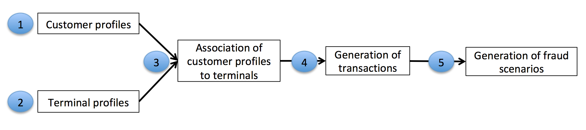
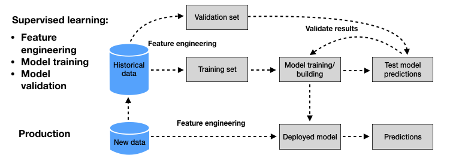

# Fraudulent Transactions Detection - ML Pipelines

>Course project of **`Machine Learning Operations (MLOPs)`**  course - [MDSAA-DS](www.novaims.unl.pt/MDSAA-DS) - Spring 2023

## Overview
@TODO

## Table of Contents

- [Fraud Detection](#fraud-detection)
  - [Motivation](#motivation)
  - [Challenges](#challenges)
  - [Dataset](#dataset)
    - [Data Simulation](#data-simulation)
      - [Transaction Generation](#transaction-generation)
      - [Fraud Scenarios Generation](#fraud-scenarios-generation)
  - [ML-based fraud detection system](#ml-based-fraud-detection-system)
    - [Fraud Detection Model](#fraud-detection-model)
    - [Traning and Validation](#training-and-validation)
- [Features](#features)
  - [ML Pipelines](#ml-pipelines)
  - [Kedro Framework](#kedro-framework)
  - [Mlflow](#mlflow)
  - [Github Actions](#github-actions)
- [Quick Start](#quick-start)
  - [Pre-requisites](#pre-requisites)
    - [Environment Setup](#environment-setup)
      - [Docker setup](#docker)
      - [Local setup](#local) 
  - [Project Structure](#project-structure)
- [Usage](#usage)
  - [Kedro Pipelines](#kedro-pipelines)
    - [ETL](#etl)
      - [Data Generation](#data-generation)
      - [Data Engineering](#data-engineering)
    - [Machine Learning](#machine-learning)
    - [Evaluation](#evaluation)
- [Future Work](#future-work)
- [Contributing](#contributing)
- [License](#license)

## Fraud Detection
Credit card fraud has become a significant concern in the modern era due to the massive volume of transactions processed daily. Detecting fraudulent activities from millions of transactions has become a daunting task for human specialists. As a result, the adoption of machine learning techniques has gained prominence in the field of credit card fraud detection, enabling the extraction of valuable patterns from vast datasets.

### Motivation
In 2020, at Cashu, a prominent fintech company in the Middle East, I led the launch of a program enabling customers to issue virtual/physical Mastercard and Visa cards without a bank account. These cards allowed users to perform a wide range of transactions, including withdrawals and both offline and online payments at ATMs and POS terminals. However, following the program's introduction, fraud reports emerged, prompting my crucial role in identifying and defining fraud scenarios within user transactions. This project offered a glimpse into our comprehensive solution for addressing users' financial needs.

### Challenges
ML for CCFD is a notoriously difficult problem. We summarise below the challenges commonly highlighted in the literature:

- **Class imbalance**: Real-world transaction data has a significantly higher proportion of legitimate transactions compared to fraudulent ones. Dealing with imbalanced data requires specialized learning strategies like sampling or loss weighting.
- **Concept drift**: Transaction and fraud patterns evolve over time, necessitating the ability to adapt to new techniques and changing behaviors of fraudsters.
- **Near real-time requirements**: Fraud detection systems must quickly identify fraudulent transactions, even with a high volume of data, necessitating fast classification times and scalable solutions.
- **Categorical features**: Transactional data often contain categorical features that need to be transformed into numerical representations for effective machine learning algorithms. Techniques like feature aggregation or deep-learning approaches are commonly used.
- **Sequential modeling**: Modeling unique characteristics of sequential data from terminals and customers is crucial for detecting abnormal behaviors. This can be achieved through feature aggregation or employing sequential prediction models like hidden Markov models or recurrent neural networks.
- **Performance measures**: Traditional classification performance metrics are not ideal for fraud detection due to class imbalance and the complex cost structure. An effective fraud detection system should maximize the detection of fraud while minimizing false positives.
- **Lack of public datasets**: Confidentiality concerns prevent the availability of real-world credit card transaction data for public use. This scarcity of datasets limits reproducibility and makes it challenging to compare different fraud detection techniques.

### Dataset
The credit card fraud detection dataset typically consists of transaction data collected by payment processors or banks, categorized into three main groups: 
- **Account-related features** include account number, date of opening, card limit, and expiry date.
- **Transaction-related features** include transaction reference number, account number, amount, terminal/POS number, and time.
- **Customer-related features** include customer numbers and types. 

The dataset is organized in a tabular form, with each transaction representing the amount paid by a customer to a merchant at a specific time. Legitimacy of transactions is indicated by a binary label, with 0 for genuine transactions and 1 for fraudulent transactions.

#### Data Simulation

The transaction data simulator we present below is a simplified approximation of real-world dynamics. Its design choice focuses on generating transactions and fraudulent behaviors with simple rules. The simulated datasets aim to highlight the issues faced by fraud detection practitioners with real-world data. 
These datasets include class imbalance (less than 1% fraudulent transactions), a combination of numerical and categorical features (with numerous categorical values), complex feature relationships, and time-dependent fraud scenarios.

##### Transaction Generation
The simulation follows a five-step process:

1. **Customer Profile Generation**: Each customer's spending habits are simulated by defining properties such as geographical location, spending frequency, and spending amounts. These customer properties are represented in a table known as the customer profile table.
2. **Terminal Profile Generation**: Terminal properties are based on geographical location and are represented in a table known as the terminal profile table.
3. **Association of Customer Profiles to Terminals**: Customers are associated with terminals based on geographical proximity. This step adds a 'list_terminals' feature to each customer profile, indicating the set of terminals accessible to that customer.
4. **Transaction Generation**: The simulator iterates through customer profiles, generating transactions based on their properties (spending frequencies, amounts, and available terminals). This results in a table of transactions.
5. **Fraud Scenario Generation**: The final step involves labeling transactions as legitimate or fraudulent by implementing three different fraud scenarios.

##### Fraud Scenarios
The simulator implements three fraud scenarios:

- **Scenario 1**: Transactions exceeding an amount of 220 are flagged as fraudulent. This straightforward scenario serves as a baseline to validate the implementation of a fraud detection technique.
- **Scenario 2**: Two terminals are randomly selected each day, and all transactions on these terminals for the next 28 days are marked as fraudulent. This scenario simulates criminal use of terminals, such as phishing. Detection can be achieved by tracking the number of fraudulent transactions on the compromised terminals and adapting to concept drift over the 28-day period.
- **Scenario 3**: Three customers are randomly chosen each day, and for the next 14 days, one-third of their transactions have their amounts multiplied by 5 and classified as fraudulent. 

This scenario replicates card-not-present fraud due to leaked customer credentials. Detecting this scenario requires monitoring the spending patterns of customers and adapting to concept drift.

### ML-based Fraud Detection System
Two stages can be distinguished in the design of an ML-based fraud detection system. 
- First stage consists of **building a prediction model** from a set of labeled historical data. This process is called supervised learning since the label of the transactions (genuine or fraudulent) is known.
- Second stage, the prediction model obtained from the supervised learning process is used to **predict the label of new transactions**.

#### Fraud Prediction Model
For fraud detection, the output domain $\mathcal{Y}$ is usually the predicted class for a given input $x$, that is $\mathcal{Y}=\{0,1\}$. Given that the output class is binary, these prediction models are also called *binary classifiers*. Alternatively, the output may also be expressed as a fraud probability, with $\mathcal{Y}=[0,1]$, or more generally as a risk score, with $\mathcal{Y} = \mathbb{R}$, where higher values express higher risks of fraud. 

The training (or building) of a prediction model $h(x,\theta)$ consists of finding the parameters $\theta$ that provide the best performance. The performance of a prediction model is assessed using a loss function, that compares the true label $y$ to the predicted label $\hat{y}=h(x,\theta)$ for an input $x$. In binary classification problems, a common loss function is the zero/one loss function $L_{0/1}$, which assigns a loss equal to one in the case of wrong prediction, and zero otherwise:

$$
\begin{align}
L_{0/1}: \mathcal{Y} \times \mathcal{Y} &\rightarrow& \{0,1\} \\
y,\hat{y} &= & 
\begin{cases}
    1,& \text{if } y \ne \hat{y}\\
    0,& \text{if } y=\hat{y}
\end{cases}
\end{align}
$$

#### Training and Validation
- The zero/one loss function is a standard loss function for binary classification problems. It is however not well suited for credit card fraud detection problems, due to the high-class imbalance (much more genuine than fraudulent transactions). Estimating the performance of a fraud detection system is a non-trivial issue.

- Particular care must be taken in practice when splitting the dataset into training and validation sets, due to the sequential nature of credit card transactions, and the delay in fraud reporting.

## Contributing

Pull requests are welcome. For major changes, please open an issue first to discuss what you would like to change.

## License
[MIT](https://choosealicense.com/licenses/mit/)

Great Expectations

