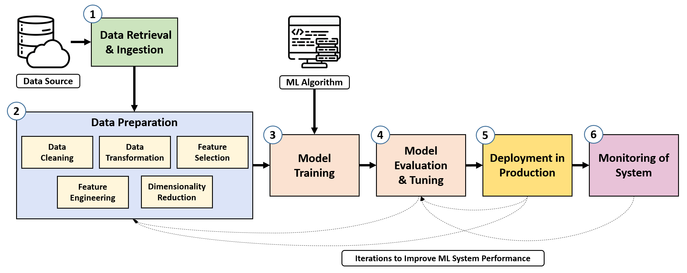

# Fraudulent Transactions Detection - ML Pipelines

>Course project of **`Machine Learning Operations (MLOPs)`**  course - [MDSAA-DS](www.novaims.unl.pt/MDSAA-DS) - Spring 2023

## Overview

This project aims to build a machine learning pipeline for detecting fraudulent transactions in credit card data. The pipeline is built using the [Kedro](https://kedro.readthedocs.io/en/stable/) framework and [MLflow](https://mlflow.org/) for experiment tracking. The pipeline is deployed using [Docker](https://www.docker.com/) and [Github Actions](https://github.com/features/actions) for CI/CD.

## Table of Contents

- [Fraud Detection](#fraud-detection)
  - [Motivation](#motivation)
  - [Challenges](#challenges)
  - [Dataset](#dataset)
    - [Data Simulation](#data-simulation)
      - [Transaction Generation](#transaction-generation)
      - [Fraud Scenarios Generation](#fraud-scenarios-generation)
  - [ML-based fraud detection system](#ml-based-fraud-detection-system)
    - [Fraud Detection Model](#fraud-detection-model)
    - [Traning and Validation](#training-and-validation)
- [General Pipeline Structure](#general-pipeline-structure)
- [Kedro Framework](#kedro-framework)
- [Mlflow](#mlflow)
- [Docker](#docker)
- [Github Actions](#github-actions)
- [Quick Start](#quick-start)
  - [Environment Setup](#environment-setup)
    - [Docker setup](#docker)
    - [Local setup](#local) 
  - [Project Structure](#project-structure)
- [Usage](#usage)
  - [Docker](#docker-usage)
  - [Local](#local-usage)
- [Contributing](#contributing)
- [License](#license)


## Fraud Detection
Credit card fraud has become a significant concern in the modern era due to the massive volume of transactions processed daily. Detecting fraudulent activities from millions of transactions has become a daunting task for human specialists. As a result, the adoption of machine learning techniques has gained prominence in the field of credit card fraud detection, enabling the extraction of valuable patterns from vast datasets.

### Motivation
In 2020, at Cashu, a prominent fintech company in the Middle East, I led the launch of a program enabling customers to issue virtual/physical Mastercard and Visa cards without a bank account. These cards allowed users to perform a wide range of transactions, including withdrawals and both offline and online payments at ATMs and POS terminals. However, following the program's introduction, fraud reports emerged, prompting my crucial role in identifying and defining fraud scenarios within user transactions. This project offered a glimpse into our comprehensive solution for addressing users' financial needs.

### Challenges
ML for CCFD is a notoriously difficult problem. We summarise below the challenges commonly highlighted in the literature:

- **Class imbalance**: Real-world transaction data has a significantly higher proportion of legitimate transactions compared to fraudulent ones. Dealing with imbalanced data requires specialized learning strategies like sampling or loss weighting.
- **Concept drift**: Transaction and fraud patterns evolve over time, necessitating the ability to adapt to new techniques and changing behaviors of fraudsters.
- **Near real-time requirements**: Fraud detection systems must quickly identify fraudulent transactions, even with a high volume of data, necessitating fast classification times and scalable solutions.
- **Categorical features**: Transactional data often contain categorical features that need to be transformed into numerical representations for effective machine learning algorithms. Techniques like feature aggregation or deep-learning approaches are commonly used.
- **Sequential modeling**: Modeling unique characteristics of sequential data from terminals and customers is crucial for detecting abnormal behaviors. This can be achieved through feature aggregation or employing sequential prediction models like hidden Markov models or recurrent neural networks.
- **Performance measures**: Traditional classification performance metrics are not ideal for fraud detection due to class imbalance and the complex cost structure. An effective fraud detection system should maximize the detection of fraud while minimizing false positives.
- **Lack of public datasets**: Confidentiality concerns prevent the availability of real-world credit card transaction data for public use. This scarcity of datasets limits reproducibility and makes it challenging to compare different fraud detection techniques.

### Dataset
The credit card fraud detection dataset typically consists of transaction data collected by payment processors or banks, categorized into three main groups: 
- **Account-related features** include account number, date of opening, card limit, and expiry date.
- **Transaction-related features** include transaction reference number, account number, amount, terminal/POS number, and time.
- **Customer-related features** include customer numbers and types. 

The dataset is organized in a tabular form, with each transaction representing the amount paid by a customer to a merchant at a specific time. Legitimacy of transactions is indicated by a binary label, with 0 for genuine transactions and 1 for fraudulent transactions.


#### Data Simulation
The credit card transaction data is obtained from the collaboration between Worldline and Machine Learning Group. It is a realistic simulation of real-world credit card transactions and has been designed to include complicated fraud detection issues.

The transaction data simulator we present below is a simplified approximation of real-world dynamics. Its design choice focuses on generating transactions and fraudulent behaviors with simple rules. The simulated datasets aim to highlight the issues faced by fraud detection practitioners with real-world data. 
These datasets include class imbalance (less than 1% fraudulent transactions), a combination of numerical and categorical features (with numerous categorical values), complex feature relationships, and time-dependent fraud scenarios.

##### Transaction Generation
The simulation follows a five-step process:

1. **Customer Profile Generation**: Each customer's spending habits are simulated by defining properties such as geographical location, spending frequency, and spending amounts. These customer properties are represented in a table known as the customer profile table.
2. **Terminal Profile Generation**: Terminal properties are based on geographical location and are represented in a table known as the terminal profile table.
3. **Association of Customer Profiles to Terminals**: Customers are associated with terminals based on geographical proximity. This step adds a 'list_terminals' feature to each customer profile, indicating the set of terminals accessible to that customer.
4. **Transaction Generation**: The simulator iterates through customer profiles, generating transactions based on their properties (spending frequencies, amounts, and available terminals). This results in a table of transactions.
5. **Fraud Scenario Generation**: The final step involves labeling transactions as legitimate or fraudulent by implementing three different fraud scenarios.


##### Fraud Scenarios
The simulator implements three fraud scenarios:

- **Scenario 1**: Transactions exceeding an amount of 220 are flagged as fraudulent. This straightforward scenario serves as a baseline to validate the implementation of a fraud detection technique.
- **Scenario 2**: Two terminals are randomly selected each day, and all transactions on these terminals for the next 28 days are marked as fraudulent. This scenario simulates criminal use of terminals, such as phishing. Detection can be achieved by tracking the number of fraudulent transactions on the compromised terminals and adapting to concept drift over the 28-day period.
- **Scenario 3**: Three customers are randomly chosen each day, and for the next 14 days, one-third of their transactions have their amounts multiplied by 5 and classified as fraudulent. 

This scenario replicates card-not-present fraud due to leaked customer credentials. Detecting this scenario requires monitoring the spending patterns of customers and adapting to concept drift.

### ML-based Fraud Detection System
Two stages can be distinguished in the design of an ML-based fraud detection system. 
- First stage consists of **building a prediction model** from a set of labeled historical data. This process is called supervised learning since the label of the transactions (genuine or fraudulent) is known.
- Second stage, the prediction model obtained from the supervised learning process is used to **predict the label of new transactions**.


#### Fraud Prediction Model
For fraud detection, the output domain $\mathcal{Y}$ is usually the predicted class for a given input $x$, that is $\mathcal{Y}=\{0,1\}$. Given that the output class is binary, these prediction models are also called *binary classifiers*. Alternatively, the output may also be expressed as a fraud probability, with $\mathcal{Y}=[0,1]$, or more generally as a risk score, with $\mathcal{Y} = \mathbb{R}$, where higher values express higher risks of fraud. 

The training (or building) of a prediction model $h(x,\theta)$ consists of finding the parameters $\theta$ that provide the best performance. The performance of a prediction model is assessed using a loss function, that compares the true label $y$ to the predicted label $\hat{y}=h(x,\theta)$ for an input $x$. In binary classification problems, a common loss function is the zero/one loss function $L_{0/1}$, which assigns a loss equal to one in the case of wrong prediction, and zero otherwise:

$$
\begin{align}
L_{0/1}: \mathcal{Y} \times \mathcal{Y} &\rightarrow& \{0,1\} \\
y,\hat{y} &= & 
\begin{cases}
    1,& \text{if } y \ne \hat{y}\\
    0,& \text{if } y=\hat{y}
\end{cases}
\end{align}
$$

#### Training and Validation
- The zero/one loss function is a standard loss function for binary classification problems. It is however not well suited for credit card fraud detection problems, due to the high-class imbalance (much more genuine than fraudulent transactions). Estimating the performance of a fraud detection system is a non-trivial issue.

- Particular care must be taken in practice when splitting the dataset into training and validation sets, due to the sequential nature of credit card transactions, and the delay in fraud reporting.

## General Pipeline Structure

The goal of these pipelines is to create a systematic workflow where raw data is transformed into actionable business insights in an automated and repeatable fashion.
Its importance comes from automating manual steps in the data science development cycle, which are repetitive, labour-intensive, error-prone, and time-consuming.



## Kedro Framework

Kedro is a python package which facilitates the prototyping of data pipelines. It aims at enforcing software engineering best practices (separation between I/O and compute, abstraction, templating…). 

- Kedro Pipelines:
  - ETL pipelines.
    - Data Generation
    - Data Ingestion
    - Data Transformation
    - Data Loading
    - Data Preprocessing
  - Machine Learning pipelines
    - Model training
    - Model evaluation
  - Inference pipelines
    - Model serving
    - Model monitoring

## MLflow

Mlflow is a library which manages the lifecycle of machine learning models. Mlflow provides 4 modules:

- **Mlflow Tracking**: This modules focuses on experiment versioning. Its goal is to store all the objects needed to reproduce any code execution.
- **Mlflow Projects**: This module provides a configuration files and CLI to enable reproducible execution of pipelines in production phase.
- **Mlflow Models**: This module defines a standard way for packaging machine learning models, and provides built-in ways to serve registered models.
- **Mlflow Model Registry**: This modules aims at monitoring deployed models.

## Github Actions

Github Actions is a CI/CD tool which allows to automate the execution of workflows. It is integrated with Github, and can be triggered by events such as a push on a branch, a pull request, or a new release.

## Quick Start

### Environment Setup

Feel free to use any of the following methods to run the application locally.

#### Docker

- Prerequisites
  ```requirements.txt
    Docker
    Docker-Compose
  ```

This application is shipped with the Docker Compose environment and requires Docker to be installed locally and running.
If you're not familiar with Docker or don't have it locally, please reach out to 
[the official website](https://www.docker.com) to get the latest version and installation instructions.

Once you have Docker up and running please perform the following command to start the application:

```shell
cp .env.example .env
```

`.env` file contains all the environment variables that are used by the containers and can be modified to suit your needs.

```shell
docker-compose up
```

This will start the application and create the following containers:

- mlflow server running on port 5001
  - make sure to edit `mlflow.yml` in `conf/base/` to set the `mlflow_tracking_uri`. 
- fastapi server running on port 80
- kedro container running on port `4142 (kedro-viz)` and `8889 (jupyter notebook)`.

```shell
docker-compose down --rmi all
```

This will stop the application and remove containers & network.

#### Local

- Prerequisites
  ```requirements.txt
    git
    Python 3.8+
    pip
    Conda
    kedro
    kedro-viz
    mlflow
    kedro-mlflow
  ```
To run the application locally, you need to create a virtual environment for your project.

```shell
conda create --name <env> python=3.10 -y
```

Activate the environment and install the dependencies.

```shell
conda activate <env>
cd kedro/fraud-detection
pip install -r requirements.txt
```

#### Project Structure

```shell
.
├── app
│   └── main.py
├── docker
│   ├── app
│   │   └── config
│   ├── kedro
│   │   ├── bin
│   │   └── config
│   └── mlflow-server
│       ├── bin
│       └── config
├── kedro
│   └── fraud_detection
│       ├── conf
│       │   ├── base
│       │   └── local
│       ├── data
│       │   ├── 01_raw
│       │   ├── 02_intermediate
│       │   ├── 03_primary
│       │   ├── 04_feature
│       │   ├── 05_model_input
│       │   ├── 06_models
│       │   ├── 07_model_output
│       │   └── 08_reporting
│       ├── docs
│       │   ├── build
│       │   ├── imgs
│       │   └── source
│       ├── logs
│       ├── notebooks
│       └── src
│           ├── build
│           ├── fraud_detection
│           └── tests
└── mlruns
```

## Usage

### Docker

To execute kedro commands, you need to enter the kedro container first.


```shell
 docker exec -it kedro-fraud-detection /bin/bash
 
 cd projects/fraud-detection
 
 kedro <command>
```

example:

```shell
 kedro --help


Global commands from Kedro
Commands:
  docs     See the kedro API docs and introductory tutorial.
  info     Get more information about kedro.
  new      Create a new kedro project.
  starter  Commands for working with project starters.

Global commands from Kedro-Viz
Commands:
  viz  Visualise a Kedro pipeline using Kedro viz.

Project specific commands from Kedro
Commands:
  activate-nbstripout  Install the nbstripout git hook to automatically...
  build-docs           Build the project documentation.
  build-reqs           Run `pip-compile` on src/requirements.txt or the...
  catalog              Commands for working with catalog.
  ipython              Open IPython with project specific variables loaded.
  jupyter              Open Jupyter Notebook / Lab with project specific...
  lint                 Run flake8, isort and black.
  micropkg             Commands for working with micro-packages.
  package              Package the project as a Python wheel.
  pipeline             Commands for working with pipelines.
  registry             Commands for working with registered pipelines.
  run                  Run the pipeline.
  test                 Run the test suite.

Project specific commands from Mlflow
Commands:
  mlflow  Use mlflow-specific commands inside kedro project.
```

Run `kedro viz` to visualize the pipeline, and open `localhost:4142` in your browser.
```shell
kedro viz --host=0.0.0.0 --no-browser
```

### Local

```shell
  cd kedro/fraud-detection
    
  kedro <command>
```

## Contributing

Pull requests are welcome. For major changes, please open an issue first to discuss what you would like to change.

## License
[MIT](https://choosealicense.com/licenses/mit/)